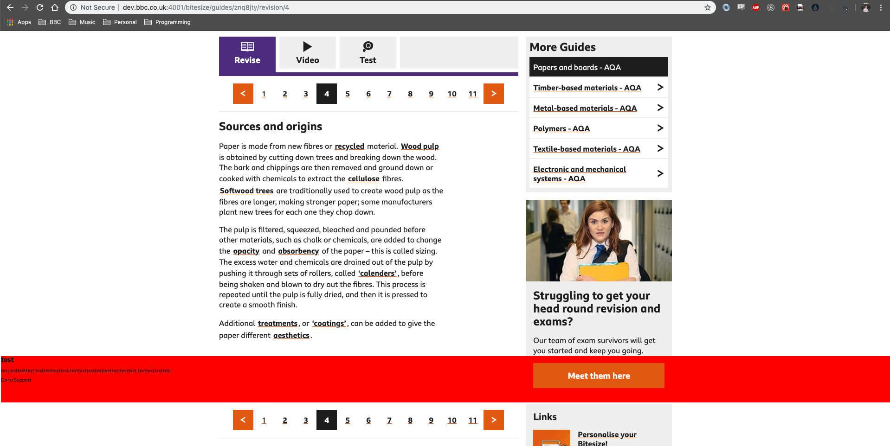

# BITESIZE-10338-Spike
Spike Investigation for 10388

## Introduction

The aim of ticket 10338 is to investigate the ease of adding a full page width, animated banner into a revision chapter (study-guide).

## Problem scope & Aims

The Banner has been suggested in a few places, essentially the investigation involves finding the most suitable place to have a full width banner in a Revision Chapter. The Aims are to determine:

- If this be done part-way through a revision chapter (some point after the right hand navigation)

- If this be done at the bottom of a revision chapter (before the pagination)

- If we identify the point on a revision chapter where the right hand navigation ends (to decide if the banner should show)

## Findings

In terms of placing the banner part-way through a revision chapter, this is certainly achievable if the Banner is located inside of the Revision Chapter component of the Study-Guide. Simply specifying a `pageIndex` prop value that the Banner will appear on should make this work, this could also be a random value if we can find a way to determine the max value for page index's.

In regards to placing the Banner outwith the Revision Chapter Component (which may be necessary), this could be done using React Refs, passing the `pageIndex` value into the parent component us it to display the Banner accordingly.
- However React documentation does not recommend this, and always suggests `Lifting the State`.

____
The Study Guide view morph-module is built up of several different components, which make up the structure & shape of each Study Guide.

The main component that handles the layout is the `GuideLayout` component, which returns the complete `view template`. The `Guide Layout` is passed a `children` prop, which is a sub-component to be rendered (a React DOM node (?)). This references what will be displayed in the `main` section of the page. i.e a `Revision Guide`. This main section is what we see on the left hand side of the page.

Because the `Guide Layout` is responsible for the layout of the page, it directly controls the `Right Hand Navigation` as well as any main `children` content. Which in essence means that the page flows differently from the `main` section (lhs) & the Right Hand Nav. This causes issues with trying to implement a full page-width banner:

- As the `GuideLayout` has a certain width, it requires a hacky fix to break out of the specified width. See `Part Solutions`

- The `GuideLayout` controls the page makeup, placing a full width banner in a sub component (e.g above pagination) is difficult as said sub component has no access or understanding of the page layout.

- If the full width banner is inside a `child` component, it won't have the ability to avoid the Right hand side navigation.

- The Banner could be placed inside of the `GuideLayout`. This will allow us to achieve Question 3. However the Banner will need to be at the end or beginning of the page.

A way around this may be to try to re-structure the `bitesize-study-guide-view`. Particularly the `GuideLayout`, the `Asides` (Right Hand Navigation) & any `children` components that the `GuideLayout` uses.

## Part Solutions

By experimenting with the components themselves I was able to create a Banner which stretched across the width of the screen. This was tricky at first, as the `main` section of the Study Guide view has a limited width. However following the second answer of this solution:

https://stackoverflow.com/questions/5581034/is-there-are-way-to-make-a-child-divs-width-wider-than-the-parent-div-using-css

I was able to use the viewport to implement the required Banner.
However as can be seen from the screenshot below. There is still difficulty interacting with the right hand navigation.

This can be fixed in a way by adding a margin value to the top of the manner, pushing it down a certain ammount to avoid interfering with the Right Hand Navigation, though this is *hacky* and definitely not always appropriate, as the main section & the Right Hand Navigation will change depending on study guide.

By placing the asides inside of the `RevisionChapter` component itself we also get a bit more control over the page layout, though this would be more related to the section below.

To achieve what we want, in that, we have a full width banner, inside of a `RevisionChapter`. It will be neceassary to change the `bitesize-study-guide-view` in a more thorough manner. The layout that the page currently utilises, does not allow for sub components with a large width to interact with the pages `other components` very easily.

## Answers

1. Can this be done part-way through a revision chapter (some point after the right hand navigation) 

- Yes, pagination value can be used via a React Reference or directly in the `Revision Chapter` compnent.

2. If this be done at the bottom of a revision chapter (before the pagination) - Not very easily.

- There are limitations with the current component layout that restrict a sub component of `full viewport width`, inside of the `GuideLayout`. The Right Hand navigation is too high in the component heirarchy for the layout to sit well with a full width Banner

3. If we identify the point on a revision chapter where the right hand navigation ends (to decide if the banner should show)

- The point that the right hand navigation ends does not exist inside of the Revision Chapter, the `Asides` are part of the `GuideLayout` & as such, the `study-guide-view` would need to be restructured entirely.

## Conclusion

The Spike was semi-successful in regards to determining if a full width banner is an appropriate addition to the Revision Chapter of the StudyGuide view. There is definitely room & scope for adding a full-width Banner to the page, at a certain tab & at a particular position. Though achievable, it stands that the scope of the ticket must be taken into consideration. The current layout of the page requires some more thought into how to break up the page & how best to manipulate the dual nature of the page flow, to accomodate said Banner.

## Jira
____
https://jira.dev.bbc.co.uk/browse/BITESIZE-10338
